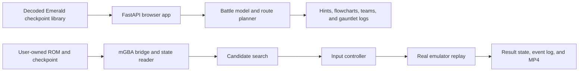

# Emerald Battle Lab

Plan difficult Pokémon Emerald battles from a captured run, inspect the reasoning, and test selected lines against the real game through mGBA.

[Run the judge demo](#judge-quickstart-no-rom-required) · [Watch the Build Week demo draft](submission/build-week-demo-draft.mp4) · [Read the architecture notes](docs/architecture.md) · [See the proof manifest](submission/PROOF_MANIFEST.md)

Emerald Battle Lab is an open-source battle-planning prototype for players who are stuck but still want to make the decisions themselves. It works from the player’s actual party, moves, items, levels, and available boxed Pokémon. The browser app can explore a committed, ROM-free library of a completed Emerald run. Developers who provide their own game files can also use the local mGBA path to read a checkpoint, search candidate actions, replay a chosen policy, and save evidence.

The central engineering decision is simple: a strategy predicted by a calculator is not automatically a working strategy. Damage rolls, trainer behavior, menu state, timing, and small mechanics errors can invalidate an otherwise convincing plan. For the local emulator workflow, mGBA is the final check. A line is labeled cartridge-verified only after the game itself reaches the expected result.

The project began as a solver for the Emerald ROM hack Pokémon Run & Bun. Work on that version exposed the difference between theoretical planning and real-game proof. The public project now defaults to standard Pokémon Emerald because it is easier for judges and players to understand, while the earlier research mode remains available as an experimental compatibility path.

## Current status

| Area | Status | What is available |
| --- | --- | --- |
| Emerald trainer atlas | Implemented | Searchable trainers, route and floor maps, required-story markers, level-cap context, and 173 decoded checkpoints covering 158 unique encounters. |
| ROM-free battle planner | Implemented | Singles and doubles planning from captured parties, Gen III damage data, crit-aware branches, team selection, item suggestions, flowcharts, and saved results. |
| Hint Mode | Implemented | Progressive guidance can reveal matchup needs and team direction before exposing a full line. |
| Gauntlet Mode | Implemented as an abstract planner | Plans several fights in order, carries or heals state according to the selected rules, saves logs, and reports the first failed safety gate. |
| mGBA search and replay | Implemented, setup-sensitive | Reads a compatible local checkpoint, runs candidate policies in parallel emulator instances, replays the selected line, and writes logs, states, and MP4 evidence. |
| Repeated and crit-aware validation | Implemented with limits | Candidate lines can be replayed across shifted RNG frames and checked for modeled critical-hit branches. This is evidence, not a mathematical guarantee. |
| Emerald overworld and PC automation | Experimental | Some navigation and preparation routines exist, but general travel between arbitrary Emerald fights is not a supported public claim. |
| Run & Bun mode | Experimental legacy mode | Kept for continued research; its custom mechanics, memory assumptions, and route playbooks should not be treated as standard Emerald behavior. |

The committed Hardcore Nuzlocke League audit is deliberately candid: Sidney, Phoebe, and Glacia pass its no-faint gate, while the saved Drake plan is rejected after three party members faint. Wallace is therefore not marked as validated. The app reports the stopped run instead of presenting an incomplete route as a clear.

## Judge quickstart: no ROM required

The safest demo path uses decoded JSON fixtures and runs entirely in the browser interface. It does not contain or download a ROM, battery save, or emulator state.

Requirements:

- Python 3.12 or newer
- A modern browser

```bash
git clone https://github.com/nathanyfekadu-prog/emerald-battle-lab.git
cd emerald-battle-lab
python3 -m venv .venv
source .venv/bin/activate
python -m pip install --upgrade pip
python -m pip install -r requirements.txt
python main.py web --port 8000 --open
```

If the browser does not open automatically, visit:

```text
http://localhost:8000/?game=emerald&view=emerald
```

Suggested judge flow:

1. Use the trainer atlas to search for an Emerald trainer or select one from a rendered route map.
2. Open that encounter in the Simulator and inspect the captured party and proposed line.
3. Turn on Hint Mode to see the strategy disclosed in stages.
4. Open Gauntlet, load the Elite Four → Wallace preset, and inspect both the accepted fights and the Drake rejection.

The ROM-free planner is useful for exploring the recorded run, but it is still an internal model. Its result is labeled separately from emulator proof.

## Local emulator verification

The cartridge-backed path needs files that cannot be included in this repository:

- a lawfully obtained Pokémon Emerald `.gba` file;
- the player’s `.sav` battery save or a compatible mGBA `.ss0`, `.ss1`, or similar save state;
- mGBA 0.10.x and FFmpeg.

Development of the native bridge has been tested on macOS, primarily Apple Silicon. Other operating systems may require changes to library paths, bridge compilation, memory addresses, or input timing.

On macOS, install the external tools:

```bash
brew install mgba ffmpeg
```

For the most repeatable search, create the mGBA state at the battle command menu after the opposing lead appears and before choosing a move.

Inspect a checkpoint:

```bash
python main.py probe \
  --rom "/absolute/path/to/Pokemon Emerald.gba" \
  --state "/absolute/path/to/prebattle.ss0"
```

Search a fight through emulator trials:

```bash
python main.py solve \
  --rom "/absolute/path/to/Pokemon Emerald.gba" \
  --state "/absolute/path/to/prebattle.ss0" \
  --instances 4 \
  --iterations 60 \
  --trials-per-node 3 \
  --nuzlocke \
  --output both
```

Searches may start several headless mGBA processes and can take time. Begin with a small instance count and replay budget. Raising those values increases work; it does not turn a sampled result into a guarantee.

The web interface accepts the same local inputs and adds progress reporting, saved-run logs, video playback, and access to earlier results. Game files stay on the local machine.

## How the system works

The repository has two related paths. The captured-run path gives judges a safe, repeatable way to inspect the product. The local path adds real-game execution when the user supplies compatible files.



For emulator-backed work, the control loop is:

1. Read the live party, active battlers, HP, moves, and battle flags.
2. Enumerate legal attacks, targets, switches, and forced replacements.
3. Search candidate policies using parallel emulator trials and internal scoring.
4. Rank deathless, range-safe, and crit-aware outcomes ahead of fragile wins.
5. Replay the selected policy from the original checkpoint and verify the final game state.
6. Store the action log, replay metadata, resulting state, and video when recording is enabled.

Correctness depends on every stage agreeing. A wrong move slot, stale HP value, inaccurate recoil rule, unexpected switch, or mistimed button press can break the result. That accumulated systems problem has been harder than any one search algorithm.

## Emerald data and rules

`data/emerald_checkpoint_library.json` contains decoded battle metadata from a user-owned completed run. Its 173 named checkpoints represent 158 unique trainer encounters. The public file stores parties, eligible Box 1–12 Pokémon, trainer identifiers, map links, and boss classifications. It contains no ROM bytes or save-state binaries.

The Emerald mode combines several documented sources:

- trainer order, parties, moves, displayed stats, and required-story flags from the project’s Emerald trainer sheet;
- map structure and trainer event coordinates from the community-maintained [`pret/pokeemerald`](https://github.com/pret/pokeemerald) decompilation;
- Generation III species, moves, items, type data, and damage categories from `@pkmn/data`.

The battle engine includes Emerald’s 2× critical-hit modifier, the Gen III critical-stage table, the type-based physical/special split, doubles spread damage, damage ranges, post-KO party order, held-item effects, recoil, healing, and status handling covered by the test suite. Doubles planning includes two active slots, legal targeting, replacement order, and alternate lead pairs.

Hardcore Nuzlocke is the default judge ruleset. It disables battle items and Revives, keeps Hint Mode off until requested, and treats fainted Pokémon as unavailable. The captured run excludes the invalid Box 13 Mightyena and the Box 14 graveyard from team selection. Level suggestions respect the next Gym Leader’s ace; the planner does not recommend exceeding the current cap.

## Why the product is designed this way

**Emulator verification.** An abstract model can be confidently wrong. Reaching the expected state in mGBA is stronger evidence than a planner score, so the UI distinguishes planned, replayed, and verified results.

**Repeated trials.** One win can depend on a favorable roll. The local search can replay finalists with shifted RNG frames and inspect crit-like damage spikes. Deterministic forced-crit branches provide another safety check, but neither method covers every possible random sequence.

**Hints before instructions.** The goal is to help a stuck player understand the matchup. Hint Mode can begin with a type, role, or party suggestion before revealing exact actions.

**Save-specific advice.** Generic walkthroughs do not know which encounters survived, which moves were taught, or what items remain. The solver starts with the run the player actually has.

**No overleveling shortcut.** Team changes, moves, items, pivots, and safer answers should be considered before grinding. If a modeled fight remains unwinnable, preparation advice can suggest legal levels up to the cap and explain why the current roster fails.

## Repository guide

- `main.py` — command-line entry point for the web app, probing, solving, calibration, and preparation.
- `web/` — FastAPI server and the browser interface.
- `battle/` — battle state, actions, damage calculations, and mechanics.
- `search/` — Monte Carlo tree search and checkpoint beam search.
- `emulator/` — native mGBA bridge, RAM reading, input control, navigation, screenshots, and recording.
- `optimizer/` — turn planning, team preparation, items, and box selection.
- `data/` — Emerald trainer, map, calculator, and decoded checkpoint data.
- `tests/` — regression tests for mechanics, API behavior, state reading, doubles, preparation, switching, and replay logic.
- `docs/` — architecture, state formats, confidence model, Emerald mode, and known assumptions.
- `submission/` — Build Week draft video, proof metadata, narration notes, and publication checklist.

## Tests

Run the automated suite with:

```bash
python -m pytest -q
```

The current repository passes 189 tests. They cover damage and critical-hit behavior, doubles targeting, trainer imports, Emerald simulator inputs, Nuzlocke preparation, switch guardrails, state reading, PDF output, the planning API, and emulator-support routines. Passing unit and integration tests does not establish that every local ROM revision or emulator timing path is compatible.

## How Codex was used

The project owner set the product direction and the standard for a valid result: save-specific advice, emulator evidence, repeated validation, level-cap discipline, usable logs, and a player-facing interface. Codex served as an engineering collaborator across state decoding, the native mGBA bridge, battle mechanics, search, automation, replay repair, UI work, debugging tools, and regression tests.

That collaboration also exposed a recurring risk. A fix discovered during one interactive emulator run is not useful to other users until it becomes a repeatable code path and a regression test. The repository therefore treats logs, recorded failures, and source-level fixes as part of the product rather than disposable debugging output.

The application does not call the OpenAI API at runtime, and it does not use a trained machine-learning model to choose moves. Its planning is implemented with game data, deterministic rules, scoring, and search. Codex accelerated development; it is not a hidden runtime dependency.

## Known limitations

- The abstract planner and real cartridge can still disagree. Saved playbooks and prior recordings must be labeled separately from lines discovered by a fresh search.
- General Emerald overworld travel, Pokémon Center routing, visible PC swaps, and arbitrary multi-fight execution are not finished end to end.
- Emulator memory and input timing are sensitive to game revision, mGBA version, platform, and where the checkpoint was captured.
- RNG validation samples outcomes and models explicit branches; it cannot prove safety against every possible random sequence.
- Some legacy Run & Bun mechanics and assets remain in the repository. Emerald mode keeps them out of its trainer, calculator, and planning data paths, but the cleanup is not complete.
- The native mGBA workflow is macOS-oriented and has not been verified as a public cross-platform install.

## Roadmap

- Close the remaining mismatches between abstract planning and cartridge replay, with a regression fixture for every discovered divergence.
- Finish a general Emerald preparation-and-travel loop that visibly handles healing, party swaps, held items, and progression without trainer-specific scripts.
- Add clearer evidence grades for modeled, single-replay, repeated-replay, and branch-tested strategies.
- Test and package the native bridge for more operating systems and documented Emerald revisions.
- Expand failure feedback so an unsolved fight points to the exact stat, move, role, or level-cap constraint that blocked every searched line.

## ROMs, saves, maps, and third-party material

No Pokémon Emerald ROM, Run & Bun ROM, proprietary BIOS, battery save, or mGBA save state is distributed here. Users must provide their own lawfully obtained files for emulator-backed features. The repository’s ignore rules cover common game and state extensions.

Original project code is released under the MIT License; see [LICENSE](LICENSE). mGBA, the Smogon damage calculator family, `@pkmn/data`, browser libraries, Pokémon names, map renders, and other referenced material retain their own licenses and ownership. Review [THIRD_PARTY_NOTICES.md](THIRD_PARTY_NOTICES.md) before redistributing the project or a compiled build.

Pokémon, Pokémon Emerald, Game Boy Advance, and related names and assets belong to their respective owners. Emerald Battle Lab is an unofficial fan-made research project and is not affiliated with Nintendo, The Pokémon Company, Game Freak, Smogon, the Pokémon Run & Bun developers, or mGBA.

## License

Original code in this repository is available under the [MIT License](LICENSE).
