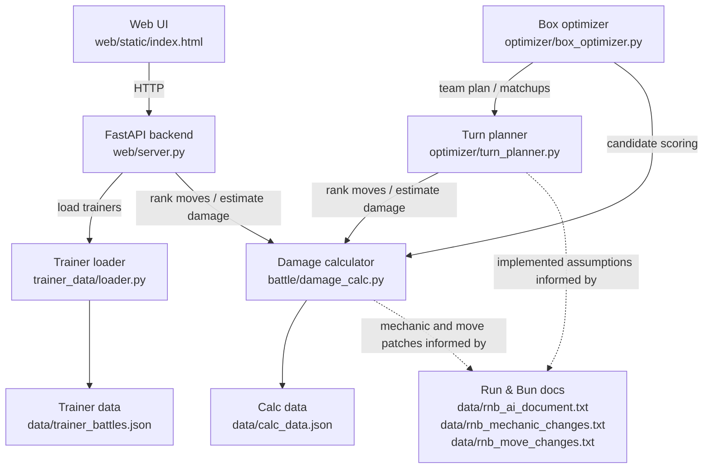

# Architecture

This project is a Pokemon Run & Bun battle assistant. The emulator solver still exists, but the current practical focus is the non-emulator planning stack:

- Calc-only Line Finder
- Prepare / Box Optimizer
- Damage Calculator
- Trainer data
- Item recommendations
- Run & Bun AI and mechanics approximation
- Confidence and risk reporting

## Major Components

## Web UI

The main web app is `web/static/index.html`. It is a single page UI with tabs for solver, prepare, calc, and simulator output.

For the current non-emulator workflow, the important area is the Calc tab:

- Embeds the Run & Bun calculator at `/rnbcalc/index.html`.
- Provides a `Line Finder` drawer in the same tab.
- Lets the user select a trainer battle from `/api/calc/trainers`.
- Lets the user paste Showdown-style team imports.
- Lets the user choose a turn cap.
- Lets the user enable crit-aware mode.
- Calls `/api/calc/sim`.
- Displays the projected line, confidence, risk notes, item recommendations, optional optimal-item retry, and matchup table.
- Includes a `Copy analysis report` button that formats the current line finder result into text for debugging.

## FastAPI Backend

`web/server.py` owns the HTTP API and wiring between UI, data, calculator, planner, and prepare flow.

Important non-emulator endpoints:

- `GET /`: serves `web/static/index.html`.
- `GET /api/calc/trainers`: loads `data/trainer_battles.json`, summarizes each battle, and returns a sample import.
- `POST /api/calc/sim`: parses pasted Showdown-style imports, builds a calc-only team, loads the selected trainer, and runs the Line Finder.
- `GET /api/result`: returns the latest solve or prepare result if one exists.

The file also still exposes emulator-oriented endpoints such as `/api/solve`, `/api/prepare`, `/api/open-gba`, `/api/kill`, and `/ws`. For the current documentation, the key part is that `/api/prepare` eventually calls the box optimizer, and `/api/calc/sim` calls the calc-only line simulation.

## Turn Planner

`optimizer/turn_planner.py` is the main planning brain for calc-only lines and prepared team plans.

It defines:

- `PlannedMember`: mutable planner-side representation of a player Pokemon.
- `PlannedEnemy`: mutable planner-side representation of a trainer Pokemon.
- `MoveChoice`: scored enemy move branch with probability and optional damage range.
- `PlayerAction`: scored player move or tactical action.
- `build_stateful_turn_plan(...)`: creates a stateful planned line for a prepared team.
- `recommend_held_items(...)`: recommends held items from the current split's available pool.

The planner carries battle memory forward turn by turn:

- HP
- fainted Pokemon
- active Pokemon
- status
- boosts
- consumed items
- residual effects
- protection, confusion, trap, Leech Seed, salt cure, and other temporary flags

It also approximates enemy AI with score-weighted move choices. It does not perfectly emulate Run & Bun AI.

## Box Optimizer

`optimizer/box_optimizer.py` supports the Prepare workflow.

The current prepare flow still starts with an emulator/MCTS baseline, then scans the PC save and builds a calc-informed team plan. The non-emulator planning pieces inside it are:

- Candidate representation with `BoxCandidateResult`.
- PC roster and party scan payloads.
- Candidate scoring against the matched trainer.
- Replacement planning for the six-party team.
- Held item optimization for the crafted team.
- Call into `build_stateful_turn_plan(...)` for a projected line.

The result payload includes:

- current team
- decoded party from the PC save
- useful bag items
- best candidate
- all candidates
- full team plan
- play-by-play line
- lead
- success estimate
- planner assumptions
- item recommendations
- risk policy

## Damage Calculator

`battle/damage_calc.py` estimates Pokemon damage and move ranking.

Core dataclasses:

- `PokemonCalcSet`: species, level, nature, EVs, IVs, ability, item, HP, status, boosts.
- `FieldState`: weather, terrain, screens, doubles flags, and selected global battle modifiers.
- `DamageContext`: field state plus critical-hit, spread, turn order, and switching context.
- `DamageRange`: 16 damage rolls, min/max damage, percent ranges, KO chance, accuracy, effective stats, and modifiers.

The calculator loads `data/calc_data.json`, which contains species, moves, items, and type chart data generated from `@pkmn/data`, with project-specific mechanics applied in code.

## Trainer Data

`data/trainer_battles.json` is loaded through `trainer_data/loader.py`.

Top-level shape:

- `source`: original source path/name.
- `dex`: mapping of imported dex names to calc species ids.
- `battles`: list of trainer battles.

Each battle becomes a `TrainerBattle`:

- `section`
- `location`
- `trainer_name`
- `is_double`
- `party`

Each party member becomes a `TrainerPokemon`:

- `species`
- `level`
- `held_item`
- `ability`
- `nature`
- `moves`
- `dex_key`

## Calc Data

`data/calc_data.json` is loaded by `DamageCalculator`.

Top-level keys currently include:

- `source`
- `generation`
- `species`
- `speciesByNum`
- `moves`
- `movesByNum`
- `items`
- `itemsByNum`
- `typeChart`

The calculator treats this as the source of base stats, move data, items, type information, and numeric lookups.

## Run & Bun AI and Mechanics Docs

The `data/` folder contains extracted Run & Bun-specific reference docs:

- `data/rnb_ai_document.txt`
- `data/rnb_mechanic_changes.txt`
- `data/rnb_move_changes.txt`
- `data/rnb_move_changes.pdf`

These files are reference material. The app does not dynamically parse all of them at runtime. Their contents have informed explicit code in the damage calculator and turn planner.

Practical implication: when a future contributor changes AI or mechanics, they should update code and tests, not only these documents.
