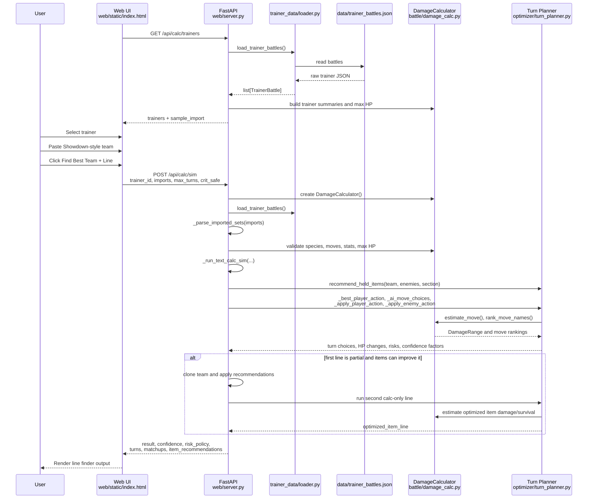

# Data Flow

This document describes the calc-only Line Finder flow: selecting a trainer, pasting a Showdown team, and asking for a projected line.

## High-Level Flow

1. The web UI loads trainer summaries from `/api/calc/trainers`.
2. The user selects one trainer battle.
3. The user pastes Showdown-style imports for the available team.
4. The user clicks `Find Best Team + Line` or `Find Crit-Safe Line`.
5. The UI posts the selected trainer id, imports, max turn count, and crit-aware flag to `/api/calc/sim`.
6. The backend parses the imports into `PlannedMember` objects.
7. The backend loads the selected `TrainerBattle` and converts its party into `PlannedEnemy` objects.
8. The planner recommends held items for the trainer section.
9. The planner tests every playable lead, then refines switches and alternate legal moves at the weakest-confidence turns while carrying HP/status/boost/item state forward.
10. Recovery moves are real stateful actions, including weather-sensitive Synthesis/Morning Sun/Moonlight and Rest sleep state.
11. If item recommendations improve the complete line, the backend keeps a second recommended-item plan.
12. The backend returns the line, confidence, risk policy, item plan, enemy state, team state, matchup table, and contingency tree.
13. The UI renders the play-by-play, searchable routes, and downloadable battle-plan PDF.

## Sequence Diagram



## Request Shape

`POST /api/calc/sim` is represented by `CalcSimRequest` in `web/server.py`:

```json
{
  "trainer_id": 0,
  "imports": "Poochyena @ Oran Berry\nLevel: 6\nAbility: Rattled\n- Bite",
  "max_turns": 30,
  "crit_safe": false,
  "weather": null,
  "reflect": false,
  "light_screen": false
}
```

`weather`, `reflect`, and `light_screen` initialize the `DamageCalculator` field state and are active throughout damage evaluation for the generated line and its contingency flowchart.

## Response Shape

The calc-only response is assembled in `_run_text_calc_sim_once(...)` in `web/server.py`.

Important fields:

- `trainer`
- `location`
- `result`: `win-line` or `partial-line`
- `confidence`: clamped float from `0.0` to `1.0`
- `crit_safe`: whether enemy crit-aware mode was used
- `risk_policy`
- `team`: final planner state for player members
- `item_recommendations`
- `enemies`: final planner state for enemy members
- `turns`: play-by-play turn rows
- `matchups`: matchup table
- `optimized_item_line`: optional second run using recommended items
- `line_search`: optional alternate lead, switch overrides, and tactical move overrides retained by the best complete line
- `contingency_flowchart`: the budgeted state-memoized branch tree; the separate completion endpoint can expand all remaining modeled branches

Each turn row includes:

```json
{
  "turn": 1,
  "enemy": "EnemySpecies",
  "answer": "PlayerPokemon",
  "action": "PlayerPokemon vs EnemySpecies: click Move.",
  "calc": "Enemy uses Move for 12; PlayerPokemon ends 40/52.",
  "risks": ["Risk note"],
  "consistency": "stateful-calc",
  "confidence": 0.87,
  "your_hp": "40/52",
  "enemy_hp": "20/45"
}
```

## Current-Item and Optimized-Item Lines

The main line always uses the items pasted in the user's import first.

If that line is not a `win-line`, `_run_text_calc_sim(...)` calls `_team_with_recommended_items(...)` and runs a second line with the planner's recommended held items. That second line appears as `optimized_item_line`.

This means item optimization is a fallback line, not a hidden mutation of the user's pasted team.

## Crit-Aware Mode

New line-finder, co-pilot, and exhaustive-flowchart requests default to `crit_safe: true`. The UI toggle can still opt a specific run out when comparing against the normal high-roll model.

Crit-aware is a **planning policy**, not a claim that every enemy hit will crit in the real fight. The linear line selects safe answers under critical-hit damage. The flowchart keeps those conservative recommendations but replays normal damage and explicitly forks real crit and non-crit outcomes.

When `crit_safe` is false:

- enemy high rolls are used
- enemy crit KOs are reported as risks when they can break the line

When `crit_safe` is true:

- enemy damaging moves are estimated with `DamageContext(critical=True)`
- enemy choices, switch checks, and survival checks use crit-aware damage
- the output risk policy explains that crit-aware mode is on

## Exhaustive Range Branches

The fast first chart is still node-budgeted, but the explicit **Explore every branch** request now pins and replays distinct applied-damage outcomes rather than forcing one minimum-player / maximum-enemy timeline. Accuracy contributes a zero-damage miss branch. Duplicate rolls that leave the same HP are grouped by probability, and rolls that all guarantee the same KO collapse into one equivalent state. Player crit, enemy crit, AI move, AI hard-switch, player damage, and enemy damage pins are part of the contingency memo key until their turn is resolved.

The Flowchart's **Start guided battle** control consumes that same tree one instruction at a time. Deterministic turns still require a confirmation click; uncertainty nodes ask the player to select the move, crit, miss, damage, or resulting-HP branch they actually observed before showing the continuation.
